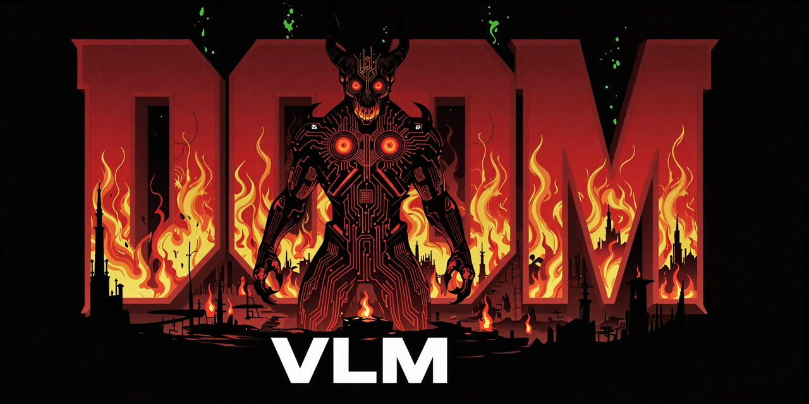

# DoomVLM

### AI plays Doom — Vision Language Models vs demons and each other

[](https://www.python.org/)
[](LICENSE)
[](https://vizdoom.farama.org/)
[](https://lmstudio.ai/)

<p align="center">
  
</p>

A Jupyter notebook that lets AI vision models play classic Doom. The AI sees the game screen, decides where to shoot or move, and you watch it happen in real time. Pit up to 4 different models against each other in deathmatch — or test them solo on 11 built-in scenarios.

**How it works:** the notebook takes a screenshot of the game, draws a numbered grid on it, sends it to a vision model, and the model calls `shoot(column)` or `move(direction)`. That's it — the model plays Doom through two simple tools.

```
Screenshot → Grid Overlay → VLM API (tool calling) → shoot / move → Game
```

---

## Table of Contents

- [Features](#features)
- [Quick Start](#quick-start)
- [System Requirements](#system-requirements)
- [LM Studio Setup](#lm-studio-setup)
- [ViZDoom Setup](#vizdoom-setup)
- [Alternative Backends](#alternative-backends)
- [RunPod GPU Cloud](#runpod-gpu-cloud)
- [Game Modes](#game-modes)
- [Configuration](#configuration)
- [How It Works](#how-it-works)
- [Examples](#examples)
- [Troubleshooting](#troubleshooting)
- [License](#license)
- [Acknowledgments](#acknowledgments)

---

## Features

- **11 Solo Scenarios** — classic ViZDoom challenges: shoot monsters, dodge fireballs, navigate mazes, gather health
- **4 Deathmatch Maps** — small and large arenas for multiplayer combat
- **Benchmark Mode** — each agent plays solo vs bots sequentially for fair comparison
- **Arena Mode** — all agents fight at once via multiprocessing, direct PvP
- **1-4 Agents** — each with its own model, API endpoint, prompts, and parameters
- **Live Visualization** — real-time per-agent game frames and scoreboard in Jupyter
- **Recording** — save episodes as GIF or MP4 with stat overlays (HP, ammo, kills, VLM reasoning)
- **Tool Use API** — models play through `shoot(column)` and `move(direction)` function calls
- **Customizable Prompts** — template variables `{health}`, `{ammo}`, `{grid_cols}`, etc.
- **Any OpenAI-compatible API** — works with LM Studio, Ollama, vLLM, OpenRouter, OpenAI, and more

---

## Quick Start

Get running in 5 minutes:

### 1. Install LM Studio

Download and install from [lmstudio.ai/download](https://lmstudio.ai/download) (macOS, Windows, Linux).

### 2. Download a model

Open LM Studio, search for **qwen3.5-0.8b** and download it.

Or use the CLI:

```bash
lms get qwen-3.5-0.8b
```

This is interactive — you'll be asked to:
1. **Select a model** — choose `lmstudio-community/Qwen3.5-0.8B-GGUF`
2. **Select quantization** — choose `Q8_0` (Recommended, ~1 GB)

After download, load it:

```bash
lms load qwen3.5-0.8b --context-length 4096
```

> `--context-length` controls how much memory the model uses. 4096 is enough for DoomVLM (each step sends one screenshot + short prompt). Use 8192 if you want longer conversation history.

> Start with the 0.8B model — it's the fastest. Try larger models once everything works.

### 3. Start the server

In LM Studio, go to the **Developer** tab and click **Start Server**.

Or use the CLI:

```bash
lms server start
```

The API will be available at `http://localhost:1234`.

### 4. Install Python dependencies

```bash
pip install -r requirements.txt
```

### 5. Open the notebook

```bash
jupyter lab doom_vlm.ipynb
```

Then:

1. **Run All Cells** (Ctrl+Shift+Enter) — this hides the code and shows the game UI
2. **Configure your agent** — the defaults work out of the box with LM Studio
3. **Choose a scenario** — start with "Basic" for the simplest test
4. **Click "Run Game"** and watch the AI play

---

## System Requirements

| | Minimum | Recommended |
|---|---|---|
| **OS** | macOS, Linux | macOS, Linux |
| **Python** | 3.11 | 3.11+ |
| **RAM** | 8 GB | 16 GB |
| **Disk** | 2 GB (for smallest model) | 10+ GB |

> Windows is supported through WSL (Windows Subsystem for Linux).

### Model sizes

| Model | VRAM / RAM | Quality |
|---|---|---|
| Qwen3.5-0.8B | ~1 GB | Basic — good for testing |
| Qwen3.5-2B | ~3 GB | Good |
| Qwen3.5-4B | ~5 GB | Better |
| Qwen3.5-9B | ~10 GB | Best |

### Performance reference

| Hardware | Model | Inference per step |
|---|---|---|
| MacBook M1 Pro 16 GB (CPU/MLX) | Qwen3.5-0.8B | ~10 sec |
| [RunPod](https://runpod.io?ref=dz2ritri) L40S (GGUF Q8) | Qwen3.5-0.8B | ~0.5 sec |

> Local CPU/MLX inference works but is slow. For real-time gameplay consider a GPU — cloud options like [RunPod](https://runpod.io?ref=dz2ritri) give you instant access to powerful GPUs.

---

## LM Studio Setup

[LM Studio](https://lmstudio.ai/) is the recommended backend — it runs models locally on your machine with zero configuration.

### Installation

1. Download from [lmstudio.ai/download](https://lmstudio.ai/download)
2. Install and open the application
3. Search for a Qwen 3.5 model in the Discover tab and download it

### Starting the server

**GUI:** Go to the Developer tab → Start Server

**CLI** (headless, no GUI needed):

```bash
# Start the API server
lms server start

# Check what models are downloaded
lms ls

# Check what's currently loaded
lms ps

# Stop the server
lms server stop
```

> Models load automatically on first API request (JIT loading). You don't need to load them manually.

### Key details

- API endpoint: `http://localhost:1234/v1/chat/completions`
- All models share the same port (1234) — the model is selected via the `model` field in the request
- `lms get` is interactive — it shows a model picker where you choose the repo (pick `lmstudio-community`) and quantization (pick `Q8_0`)
- Tool calling (function calling) is supported natively

### Official documentation

- [LM Studio Docs](https://lmstudio.ai/docs/) — main documentation
- [CLI Reference](https://lmstudio.ai/docs/cli) — all CLI commands
- [Headless Mode](https://lmstudio.ai/docs/advanced/headless) — run without GUI
- [OpenAI-compatible API](https://lmstudio.ai/docs/developer/openai-compat) — API reference
- [Tool Use / Function Calling](https://lmstudio.ai/docs/developer/openai-compat/tools) — how tool calling works
- [Model Catalog](https://lmstudio.ai/models) — browse available models

---

## ViZDoom Setup

[ViZDoom](https://vizdoom.farama.org/) is the game engine — it provides Doom as a research environment.

### Installation

```bash
pip install vizdoom
```

This is already included in `requirements.txt`, so if you ran `pip install -r requirements.txt` you're good.

### System dependencies

**Linux** (for the game window and recording):

```bash
sudo apt-get install ffmpeg fonts-dejavu-core libsdl2-dev zstd
```

**macOS** (for MP4 recording):

```bash
brew install ffmpeg
```

> The notebook auto-detects the OS and installs system dependencies automatically on first run. Manual installation is only needed if the auto-install fails.

### Official documentation

- [ViZDoom Documentation](https://vizdoom.farama.org/) — main docs
- [Python Quick Start](https://vizdoom.farama.org/introduction/python_quickstart/) — getting started
- [Default Scenarios](https://vizdoom.farama.org/environments/default/) — built-in scenarios reference
- [GitHub Repository](https://github.com/Farama-Foundation/ViZDoom) — source code
- [PyPI Package](https://pypi.org/project/vizdoom/) — package info

---

## Alternative Backends

DoomVLM works with **any OpenAI-compatible API** that supports vision and tool calling. Just change the API URL and model name in the agent configuration.

| Backend | API URL | Notes |
|---|---|---|
| [LM Studio](https://lmstudio.ai/) | `http://localhost:1234/v1/chat/completions` | Recommended. Local, free, easy setup |
| [Ollama](https://ollama.com/) | `http://localhost:11434/v1/chat/completions` | Local, free. Needs vision + tool calling model |
| [vLLM](https://docs.vllm.ai/) | `http://localhost:8000/v1/chat/completions` | Local, free. GPU required |
| [OpenRouter](https://openrouter.ai/) | `https://openrouter.ai/api/v1/chat/completions` | Cloud. Many models. Requires API key |
| [OpenAI](https://platform.openai.com/) | `https://api.openai.com/v1/chat/completions` | Cloud. GPT-4o has vision + tools. Requires API key |
| [Anthropic](https://docs.anthropic.com/) | `https://api.anthropic.com/v1/messages` | Cloud. Claude with vision + tools. Requires API key |

> You can use cloud APIs (Claude, ChatGPT, etc.) directly from your local machine — no LM Studio or GPU needed. Just set the API URL, model name, and API key in the agent config.

To use a different backend, configure the agent's **API URL**, **Model**, and **API Key** (if needed) in the notebook UI.

---

## RunPod GPU Cloud

Don't have a GPU? Run DoomVLM on a cloud GPU with [RunPod](https://runpod.io?ref=dz2ritri) — inference drops from ~10 sec/step (MacBook CPU) to ~0.5 sec/step (L40S).

### 1. Create a Pod

1. Sign up at [runpod.io](https://runpod.io?ref=dz2ritri)
2. Click **Deploy** → choose a GPU (L40S recommended, or cheaper for smaller models)
3. Select template: **Runpod Pytorch 2.8.0** (`runpod/pytorch:1.0.2-cu1281-torch280-ubuntu2404`)
4. Deploy the Pod

### 2. Connect to JupyterLab

Once the Pod is running, go to the **Connect** tab → click **Jupyter Lab** (Port 8888). This opens JupyterLab in your browser.

### 3. Upload the notebook

Drag and drop `doom_vlm.ipynb` into JupyterLab's file browser.

### 4. Install LM Studio and start serving

Open a **Terminal** in JupyterLab and run:

```bash
# Install LM Studio CLI
curl -fsSL https://lmstudio.ai/install.sh | bash

# Start the API server
lms server start

# Download a model (interactive — choose lmstudio-community GGUF, then Q8_0)
lms get qwen-3.5-0.8b

# Load the model (4k context is enough for DoomVLM)
lms load qwen3.5-0.8b --context-length 4096

# Download more models for multi-agent battles
lms get qwen-3.5-2b
lms get qwen-3.5-4b
```

### 5. Run the notebook

Open `doom_vlm.ipynb` → **Run All Cells** (Ctrl+Shift+Enter). The default agent settings point to `localhost:1234` — everything works out of the box.

> With an L40S you can serve multiple models simultaneously and run 4-agent Arena battles at real-time speed.

---

## Game Modes

### Solo Scenarios

Classic ViZDoom training scenarios. The agent plays alone against built-in enemies. Death ends the episode.

| Scenario | Description |
|---|---|
| **Basic** | A single stationary monster. Kill it ASAP. 300 tics. |
| **Simpler Basic** | Monster centered on screen. Simplest possible test. |
| **Rocket Basic** | Like Basic but with a rocket launcher — projectile has travel time. |
| **Defend the Center** | Monsters approach from all sides. Defend 360°. 26 bullets. |
| **Defend the Line** | Monsters attack from the front. Hold your ground. |
| **Deadly Corridor** | Fight through a corridor of enemies to reach the end. Skill 5/5. |
| **Predict Position** | A monster runs along a wall — predict its position and fire a rocket. |
| **Health Gathering** | Toxic floor drains HP. Collect medkits to survive. No enemies. |
| **Health Gathering Supreme** | Harder Health Gathering. Floor drains faster, fewer medkits. |
| **My Way Home** | Navigate a maze to find the exit. No enemies. Pure navigation. |
| **Take Cover** | Dodge incoming fireballs by moving left/right. No weapons. Survival. |

### Deathmatch — Benchmark Mode

Each agent plays **solo vs bots**, sequentially. Identical conditions for every agent — fair comparison.

Settings: number of bots (0–7), time limit (1–20 min), episodes (1–10).

Results table: Frags, Deaths, K/D ratio, average API latency per agent.

### Deathmatch — Arena Mode

All agents play **together in one game** via multiprocessing. Direct PvP — a faster model gets more actions per second.

Settings: number of bots (0–7), time limit (1–20 min), timing (sync or realtime).

- **Sync** — the game waits for the VLM response before advancing (fair but slow)
- **Realtime** — faster models get more turns (realistic competition)

### Deathmatch Maps

| Map | Description |
|---|---|
| **CIG map01 (small)** | Small VizDoom CIG competition arena. Fast-paced combat. |
| **CIG map02 (large)** | Large CIG arena. More room to maneuver. |
| **Multi DM** | Standard multiplayer deathmatch map. |
| **Deathmatch** | Classic Doom II deathmatch. Large map with many weapons. |

---

## Configuration

### Agent Settings

Each agent (1–4) can be configured independently:

| Setting | Default | Description |
|---|---|---|
| **Name** | Agent-1 | Display name (shown in scoreboard) |
| **API URL** | `http://localhost:1234/v1/chat/completions` | OpenAI-compatible endpoint |
| **Model** | `qwen3.5-0.8b` | Model identifier |
| **API Key** | *(empty)* | Required for cloud APIs (OpenAI, OpenRouter) |
| **System Prompt** | `"DOOM. Columns 1-{grid_cols}..."` | Instructions for the model |
| **User Prompt** | `"HP={health} AMMO={ammo}"` | Per-frame context sent with screenshot |
| **Temperature** | 0.7 | Randomness (0 = deterministic, 1 = creative) |
| **Top P** | 0.8 | Nucleus sampling threshold |
| **Top K** | 20 | Top-K sampling |
| **Presence Penalty** | 1.5 | Penalizes repetition |
| **Max Tokens** | 200 | Maximum response length |
| **History Length** | 0 | Number of previous turns to include (0 = no memory) |

### Prompt Template Variables

Use these in system and user prompts — they're replaced with live game values:

| Variable | Available In | Description |
|---|---|---|
| `{grid_cols}` | System, User, Tools | Number of grid columns on screen |
| `{health}` | User prompt | Current HP |
| `{ammo}` | User prompt | Current ammo count |
| `{frags}` | User prompt | Frag count (deathmatch only) |
| `{deaths}` | User prompt | Death count (deathmatch only) |
| `{kills}` | User prompt | Kill count (solo only) |
| `{reward}` | User prompt | Cumulative reward (solo only) |
| `{step}` | User prompt | Current game step number |

### Game Settings

| Setting | Range | Default | Description |
|---|---|---|---|
| **Grid Columns** | 3–10 | 5 | Screen divisions for aiming (more = finer aim) |
| **Tics per Action** | 1–8 | 4 | Game ticks between VLM decisions (fewer = more responsive) |
| **Image Size** | 128–1024 | 512 | Screenshot resolution sent to VLM (larger = more detail, slower) |
| **Record Format** | none/gif/mp4 | none | Save episode recordings with stat overlays |

---

## How It Works

Each game step follows this cycle:

```
1. ViZDoom renders a frame
2. The notebook takes a screenshot and draws a numbered grid overlay
3. The screenshot is resized, JPEG-compressed, and base64-encoded
4. An API request is sent to the VLM with:
   - System prompt (instructions)
   - User prompt (HP, ammo, etc.) + screenshot image
   - Tool definitions: shoot(column) and move(direction)
   - tool_choice: "required" (forces the model to call a tool)
5. The model responds with a tool call:
   - shoot(column=3) → turn to column 3 and fire
   - move(direction="forward") → move forward
6. The notebook converts this to a ViZDoom action vector
7. The action is applied to the game
8. Repeat
```

### Tools

The model has exactly two tools:

**`shoot(column)`** — shoot at the specified grid column (1 to N). The notebook calculates the turn angle needed to aim at that column based on the FOV.

**`move(direction)`** — move in the given direction. Options: `forward`, `backward`, `left`, `right`, `strafe_left`, `strafe_right`.

---

## Examples

### Quick test — single agent on Basic

1. Set up one agent with default settings (LM Studio, qwen3.5-0.8b)
2. Select **Solo** game type
3. Choose **Basic** scenario
4. Click **Run Game**

The agent should kill the stationary monster within a few steps.

### Model comparison — Benchmark

Compare different model sizes on the same scenario:

1. Add 3 agents:
   - Agent-1: `qwen3.5-0.8b`
   - Agent-2: `qwen3.5-2b`
   - Agent-3: `qwen3.5-4b`
2. Select **Deathmatch** → **Benchmark** mode
3. Choose **CIG map01 (small)**, 3 bots, 2 min time limit, 3 episodes
4. Click **Run Game**

Each agent plays 3 episodes against bots. Compare frags, deaths, and K/D ratio.

### Battle Royale — Arena

All models fight each other at the same time:

1. Add 4 agents with different models
2. Select **Deathmatch** → **Arena** mode
3. Choose **CIG map01 (small)**, Realtime timing, 0 bots, 5 min limit
4. Set **Record Format** to mp4
5. Click **Run Game**

Watch the live scoreboard and download the recording afterwards.

---

## Troubleshooting

### LM Studio server not responding

Make sure the server is running:

```bash
lms server start
lms ps  # check loaded models
```

Verify the API is accessible:

```bash
curl http://localhost:1234/v1/models
```

### Model not found

Check which models are downloaded:

```bash
lms ls
```

Download a model if needed:

```bash
lms get qwen-3.5-0.8b
```

### MP4 recording doesn't work

Install ffmpeg:

```bash
# macOS
brew install ffmpeg

# Linux
sudo apt-get install ffmpeg
```

### Empty VLM responses / agent spinning in place

This can happen with smaller models. The notebook has a built-in fallback — on empty responses, the agent moves forward instead of doing nothing.

Try:
- Increasing `max_tokens` (e.g., to 300)
- Lowering `temperature` (e.g., to 0.5)
- Using a larger model

### ViZDoom window errors

The notebook sets `SDL_VIDEODRIVER=dummy` automatically to run headless. If you see SDL-related errors, make sure the environment variable is set before importing vizdoom.

### Arena mode issues on macOS

Arena uses Python multiprocessing with `fork`, which can deadlock on macOS in some configurations. If Arena freezes, try Benchmark mode instead — it provides the same competitive data via sequential runs.

---

## License

This project is licensed under the [MIT License](LICENSE).

---

## Acknowledgments

- [ViZDoom](https://vizdoom.farama.org/) by [Farama Foundation](https://farama.org/) — the Doom research platform that makes this possible
- [LM Studio](https://lmstudio.ai/) — local LLM inference made easy
- [Qwen](https://github.com/QwenLM/Qwen3) by Alibaba — the recommended vision language models
- [id Software](https://www.idsoftware.com/) — for creating Doom
